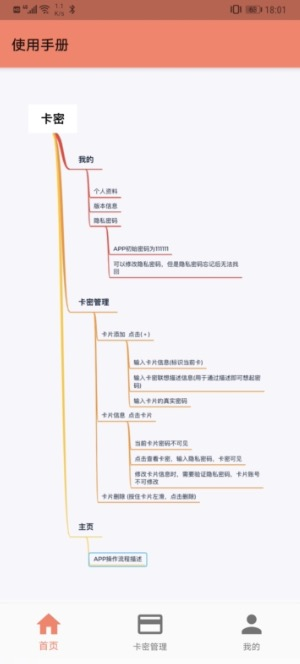
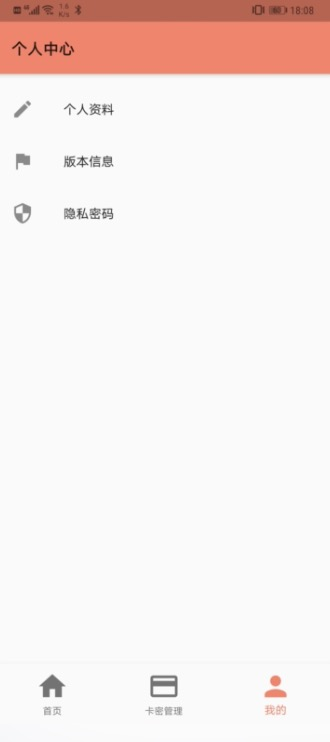

# 用于个人学习的Flutter开发的APP
通过在学习过程中，将一些学习到的东西加入到APP中，做出一个有意思的APP。
## 基础功能
APP暂时的基础功能包含 `启动图` `主页` `卡密管理` `个人中心`
### 主页
登录成功后进去主页面,主页信息现在是操作描述
### 卡密管理
卡密管理的功能是展示卡片列表,点击进入卡片详情页面,左滑可以进行删除，还可以点击 `+` 按钮进入添加页面。

1. 用户可以点击 `+` 进入卡片添加页面，主要信息有三个，卡片的账号信息、卡片密码的记忆联系描述(可以通过描述想出密码)、完整的密码
2. 点击卡片进入卡片详情页，在当前页面可以看到账号信息、描述信息、密码为不可见。若想看到密码，则点击`查看卡密` 输入隐私密码即可。
3. 用户还可以修改卡片的描述信息和密码，但是修改前需要验证隐私密码。

### 个人中心
个人中心包括 `退出登录` `个人信息` `版本信息` `隐私密码` 暂时关闭了`退出登录`

1. 用户可以修改个人信息
2. 用户可以修改隐私密码，隐私密码的初始密码为111111，隐私密码必须记住，不然一旦忘记，暂时无法找回。
3. 版本信息就是查看目前有哪些功能。

### 安卓打包
参考  https://flutterchina.club/android-release/

### 效果图

- 启动图

- 主页

- 卡片列表

- 个人中心

